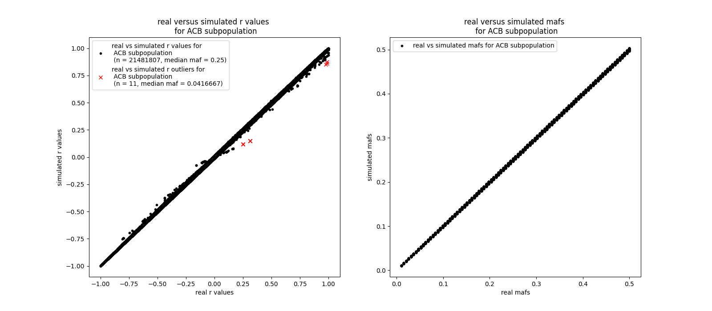
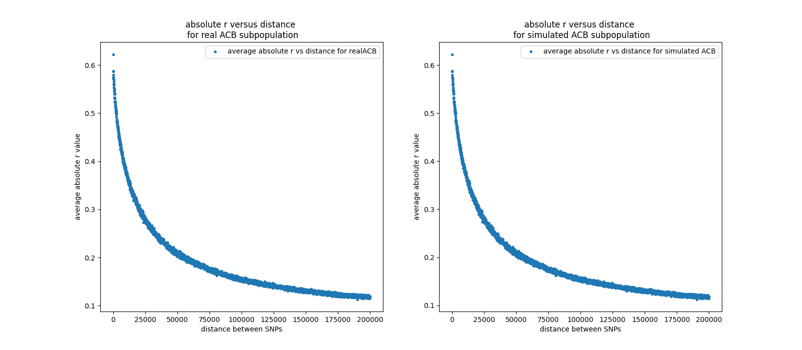
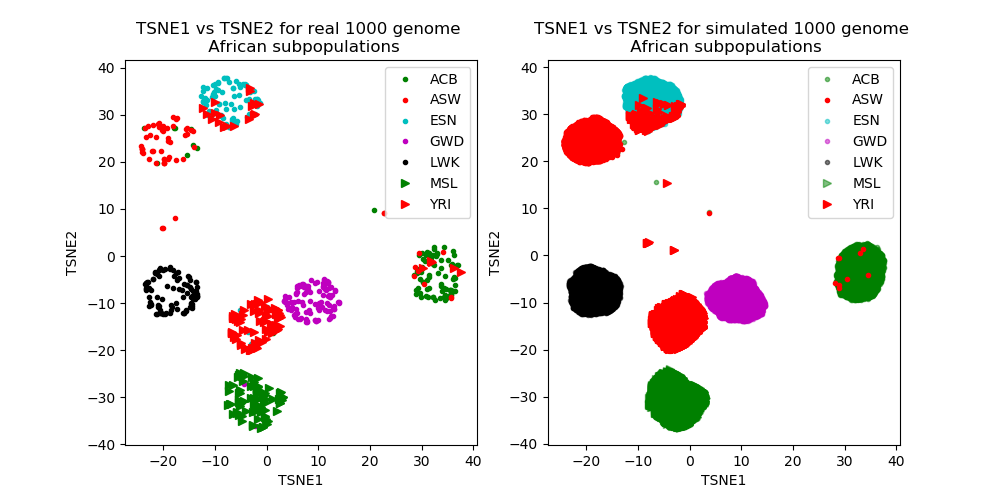

## About REGENS :dna:

REGENS (REcombinatory Genome ENumeration of Subpopulations) is an open source Python package that simulates whole genomes from real genomic segments. 
REGENS recombines these segments in a way that simulates completely new individuals while simultaneously preserving the input genomes' linkage disequilibrium (LD) pattern with extremely high fedility. REGENS can also simulate mono-allelic and epistatic single nucleotide variant (SNV) effects on a continuous or binary phenotype without perturbing the simulated LD pattern.

## Input :inbox_tray:
REGENS requires the following inputs:
- real genotype data formatted as a standard (bed, bim, fam) plink _fileset_, ideally contains a minimum of 80 unrelated individuals.
- a folder with one gzipped tab seperated dataframe per chromosome. Each dataframe, [formatted as such](https://raw.githubusercontent.com/EpistasisLab/REGENS/master/hg19/ACB/ACB_recombination_map_hapmap_format_hg19_chr_1.txt?token=AKJ677MJLXQBVU243VENRWS7NY4XC), contains genomic positions of intervals' boundaries and the intervals' recombination rates.

We provide the second input for all twenty-six 1000 genomes populations created by the [pyrho algorithm](https://github.com/popgenmethods/pyrho).

### IMPORTANT NOTICE (PLEASE READ)

**REGENS's simulated genomes are comprised entirely of concatenated segments from the input dataset's real genomes. If your input genomes are not available for public use, then you may not be allowed to publicly release the simulated dataset. Please consult the institutions that provide you access to your input genotype dataset for more information about this matter.**

## Output :outbox_tray:
Standard output is a standard (bed, bim, fam) plink fileset with the simulated genotype data (and optional phenotype information). 
If plink is not available to you, please consider [bed-reader](https://pypi.org/project/bed-reader/0.1.1/), which reads (bed, bim, fam) plink filesets into the python environment quickly and efficiently. 
 
In phenotype simulation, REGENS also outputs a distribution of phenotypes (see [example](https://github.com/EpistasisLab/REGENS/blob/master/images/example1_all_1000_genomes_ACB_simulated_phenotype_profile.png)) and a file containing the R<sup>2</sup> value of the phenotype/genotype correlation and the *inferred* beta coefficients (see [example](https://github.com/EpistasisLab/REGENS/blob/master/images/example1_all_1000_genomes_ACB_simulated_phenotype_profile.png)), which will most likely be close to but not equal to the input beta coefficients.

## Installing REGENS 

REGENS and its dependencies can be installed with pip as follows: 
```bash
pip install bed-reader
pip install numpy
pip install pandas
pip install matplotlib
pip install scipy
pip install scikit-learn
```
After the installation, please clone this repository to download the neccessary data files for REGENS to run.
On your command line, change working directory to the `regens` directory. 

## Simulate genotype data

The following command uses `ACB.bed`, `ACB.bim`, and `ACB.fam` to simulate 10000 individuals without phenotypes. Windows users should replace all "\"  linebreak characters with "^".

```bash
python regens.py \
  --in input_files/ACB \
  --out ACB_simulated \
  --simulate_nsamples 10000 \
  --simulate_nbreakpoints 4 \
  --population_code ACB \
  --human_genome_version hg19
```

## Simulate genotype data with custom recombination rate dataframes

The following command uses custom recombination rate files instead of the ones provided in the hg19 and hg38 folders (though it is just a copy of hg19/ACB). NOTE: recombination rates between similar populations (i.e. english and italian) are highly correlated, so customizing your recombination rate files is unlikely to be necessary or helpful for simulating human genotype data. 

```bash
python regens.py \
    --in input_files/ACB \
    --out ACB_simulated \
    --simulate_nsamples 10000 \
    --simulate_nbreakpoints 4 \
    --recombination_file_path_prefix input_files/hg19_ACB_renamed_as_custom/custom_chr_
```

Importantly, `custom_chr_` includes the entire recombination rate file name up to the number of the chromosome, and that every file suffix must be `.txt.gz`. Note that it is also important for the `.txt.gz` files to actually be gzipped (as opposed to a meaningless `txt.gz` extension). 

Each recombination  rate dataframe must have two tab seperated columns named "Position(bp)" and	"Map(cM)". The i<sup>th</sup> row of "Position(bp)" contains the genomic position of the left boundary for the i<sup>th</sup> genomic interval with a distinct recombination rate. The i<sup>th</sup> row of "Position(bp)" is also the genomic position of the right boundary for the (i-1)<sup>th</sup> genomic interval with a distinct recombination rate. As such, the last row of "Position(bp)" is only a right boundary, and the first row is only a left boundary. Genomic positions must increase monotonically from top to bottom. 

The (i)<sup>th</sup> value of "Map(cM)" is the cumulative recombination rate from the first position to the i<sup>th</sup> position in CentiMorgans. The first value of "Map(cM)" must be 0 because of this fact. It must be the case that the recombination rate of the interval in between any two rows b and a is equal to the Map(cM) value at row b minus the Map(cM) value at row a. These cumulative Map(cM) values must increase monotonically from top to bottom. 

An example of how this must be formatted is below (remember that there must be one per chromosome, and they must all be gzipped):

```bash
Position(bp)	Map(cM)
16050114	0.0
16058757	0.01366
16071986	0.03912
16072580	0.04013
16073197	0.04079
```

## Simulate genotype data with phenotype associations

Given at least one set of one or more SNPs, REGENS can simulate a correlation between each set of SNPs and a binary or continuous phenotype.
Different genotype encodings can be applied:

- Normally, if A is the major allele and a is the minor allele, then (AA = 0, Aa = 1, and aa = 2). However, you can _Swap_ the genotype values so that (AA = 2, Aa = 1, and aa = 0).
- You can further transform the values so that they reflect no effect (I), a dominance effect (D), a recessive effect (R), a heterozygous only effect (He), or a homozygous only effect (Ho).

The table below shows how each combination of one step 1 function (columns) and one step 2 function (rows) transforms the original (AA = 0, Aa = 1, and aa = 2) values.

|  Input = {0, 1, 2}   |Identity (I) |   Swap    |
|----------------------|-------------|-----------|
|Identity (I)          |  {0, 1, 2}  | {2, 1, 0} |
|Dominance (D)         |  {0, 2, 2}  | {2, 2, 0} |
|Recessive (R)         |  {0, 0, 2}  | {2, 0, 0} |
|Heterozygous only (He)|  {0, 2, 0}  | {0, 2, 0} |
|Homozygous only (Ho)  |  {2, 0, 2}  | {2, 0, 2} |

### Example 1: a simple additive model

A full command for REGENS to simulate genomic data with correlated phenotypes would be formatted as follows:

```bash
python regens.py \
  --in input_files/ACB --out ACB_simulated \
  --simulate_nsamples 10000 --simulate_nbreakpoints 4 \
  --phenotype continuous --mean_phenotype 5.75 \
  --population_code ACB --human_genome_version hg19 \
  --causal_SNP_IDs_path input_files/causal_SNP_IDs.txt \
  --noise 0.5 --betas_path input_files/betas.txt
```

This command simulates genotype-phenotype correlations according to the following model.
If we let _y_ be an individual's phenotype, s<sub>i</sub> be the i<sup>th</sup> genotype to influence the value of _y_ such that (AA = 0, Aa = 1, and aa = 2), and _B_ be the bias term. The goal is to simulate the following relationship between genotypes and phenotype:

y = 0.5s<sub>1</sub> + 0.5s<sub>2</sub> + 0.5s<sub>3</sub> + B + &epsilon;

where &epsilon; ~ N(&mu; = 0, &sigma;<sub>&epsilon;</sub> = 0.5E[y] and E[y] = 5.75.

<!-- h<sub>&theta;</sub>(x) = &theta;<sub>o</sub> x + &theta;<sub>1</sub>x -->
<!--  -->
<!--  -->
<!--  -->

The following files, formatted as displayed below, must exist in your working directory.
`input_files/causal_SNP_IDs.txt` contains newline seperated SNP IDs from the input bim file `input_files/ACB.bim`:
```
rs113633859
rs6757623
rs5836360
```
`input_files/betas.txt` contains one (real numbered) beta coefficient for each row in `input_files/causal_SNP_IDs.txt`:
```
0.5
0.5
0.5
```

### Example 2: inclusion of nonlinear single-SNP effects

```bash
python regens.py \
  --in input_files/ACB --out ACB_simulated \
  --simulate_nbreakpoints 4 --simulate_nsamples 10000 \
  --phenotype continuous --mean_phenotype 5.75 \
  --population_code ACB --human_genome_version hg19 --noise 0.5 \
  --causal_SNP_IDs_path input_files/causal_SNP_IDs.txt \
  --major_minor_assignments_path input_files/major_minor_assignments.txt \
  --SNP_phenotype_map_path input_files/SNP_phenotype_map.txt \
  --betas_path input_files/betas.txt
```

In addition to the notation from the first example, let S<sub>i</sub> = _swap_(s<sub>i</sub>) be the i<sup>th</sup> genotype to influence the value of _y_ such that (AA = 2, Aa = 1, and aa = 0). Also, we recall the definitions for the four nontrivial mapping functions (R, D, He, Ho) defined prior to the first example. The second example models phenotypes as follows:

y = 0.5s<sub>1</sub>+ 0.5R(S<sub>2</sub>) + 0.5He(s<sub>3</sub>) + B + &epsilon;

where &epsilon; ~ N(&mu; = 0, &sigma;<sub>&epsilon;</sub> = 0.5E[y] and E[y] = 5.75.

<!--  -->
<!-- 
 -->

Specifying that (AA = 2, Aa = 1, and aa = 0) for one or more alleles is optional and requires `input_files/major_minor_assignments.txt`.

```
0
1
0
```

Specifying the second genotype's recessiveness (AA = 0, Aa = 0, and aa = 2) and third genotype's heterozygosity only (AA = 0, Aa = 2, and aa = 0) is optional and requires `input_files/SNP_phenotype_map.txt`. 

```
regular
recessive
heterozygous_only
```

### Example 3: inclusion of epistatic effects

REGENS models epistasis between an arbitrary number of SNPs as the product of transformed genotype values in an individual.

```bash
python regens.py \
  --in input_files/ACB --out ACB_simulated \
  --simulate_nbreakpoints 4 --simulate_nsamples 10000 \
  --phenotype continuous --mean_phenotype 5.75 \
  --population_code ACB --human_genome_version hg19 --noise 0.5 \
  --causal_SNP_IDs_path input_files/causal_SNP_IDs2.txt \
  --major_minor_assignments_path input_files/major_minor_assignments2.txt \
  --SNP_phenotype_map_path input_files/SNP_phenotype_map2.txt \
  --betas_path input_files/betas.txt
```

y = 0.5s<sub>1</sub> + 0.5D(s<sub>2</sub>)s<sub>3</sub>+ 0.2Ho(S<sub>4</sub>)s<sub>5</sub>s<sub>5</sub> + B + &epsilon;

where &epsilon; ~ N(&mu; = 0, &sigma;<sub>&epsilon;</sub> = 0.5E[y] and E[y] = 5.75.

<!--  -->
<!-- 
 -->

Specifying that multiple SNPs interact (or that rs62240045 has a polynomic effect) requires placing all participating SNPs in the same tab seperated line of `input_files/causal_SNP_IDs.txt`

```
rs11852537
rs1867634	rs545673871
rs2066224	rs62240045	rs62240045
```

For each row containing one or more SNP IDs, `input_files/betas.txt` contains a corresponding beta coefficient. (Giving each SNP that participates in a multiplicative interaction its own beta coefficient would be pointless).

```
0.5
0.5
0.5
```

As before, both `input_files/major_minor_assignments.txt` and `input_files/SNP_phenotype_map.txt` are both optional.
If they are not specified, then all genotypes of individual SNPs will have the standard (AA = 0, Aa = 1, and aa = 2) encoding.

For each SNP ID, `input_files/major_minor_assignments.txt` specifies whether or not untransformed genotypes of individual SNPs follow the (AA = 2, Aa = 1, and aa = 0) encoding.
CAUTION: In general, if a SNP appears in two different effects, then it may safely have different major/minor assignments in different effects.
However, if a SNP appears twice in the same effect, then make sure it has the same major/minor assignment within that effect, or that effect may equal 0 depending on the map functions that are used on the SNP. 

```
0	
0	0
1	0	0
```
For each SNP ID, `input_files/SNP_phenotype_map.txt` specifies whether the SNP's effect is regular, recessive, dominant, heterozygous_only, or homozygous_only.

```
regular
dominant	regular
homozygous_only	regular	regular
```

In context to an epistatic interaction, first the _Swap_ function is applied to SNPs specified by `input_files/major_minor_assignments.txt`, then map functions specified by `input_files/SNP_phenotype_map.txt` are applied to their respective SNPs. The transformed genotypes of SNPs in the same row of `input_files/causal_SNP_IDs.txt` are multiplied together and by the corresponding beta coefficient in `input_files/betas.txt`. Each individual's phenotype is then the sum of row products, the bias, and the random noise term.

## Repository structure

* Folders
    * correctness_testing_ACB: A directory containing bash scripts to test code correctness on the ACB subpopulation, as well as the output for those tests. Correctness testing part 2 is optional and requires plink version 1.90Beta.
    * correctness_testing_GBR: A directory containing bash scripts to test code correctness on the GBR subpopulation, as well as the output for those tests. Correctness testing part 2 is optional and requires plink version 1.90Beta.
    * hg19: for each 1000 genomes project population, contains a folder with one gzipped recombination rate dataframe per hg19 reference human autosome.
    * hg38: for each 1000 genomes project population, contains a folder with one gzipped recombination rate dataframe per hg38 reference human autosome.
    * images: contains figures that are either displayed or linked to in this github README
    * input_files: contains examples of regens input that is meant to be provided by the user. The example custom recombination rate information is copied from that of the hg19 mapped ACB population. Also contains input for the Triadsim algorithm. The genetic input labeled as "not_trio" for Triadsim is comprised of ACB population duplicates and is only meant to compare Triadsim's runtime. 
    * unit_testing_files: A directory containing bash scripts to unit test code correctness on the ACB subpopulation, as well as the output for those tests.
* Files
    * regens.py: the main file that runs the regens algorithm
    * regens_library.py: functions that the regens algorithm uses repeatedly. 
    * regens_testers.py: functions used exclusively for correctness testing and unit testing
    * simulate_genotypes_with[suffix]: simulates the datasets described in the readme

## Contributing
If you find any bugs or have any suggestions/questions, please feel free to [post an issue](https://github.com/EpistasisLab/regens/issues/new)! 
Please refer to our [contribution guide](CONTRIBUTING.md) for more details.
Thanks for your support!

## License
MIT + file LICENSE

## Technical details

Each genome that REGENS simulates starts out as an empty template of SNP positions without SNP values, which is divided into empty segments that are demarcated by breakpoints. The probability of drawing any genomic position for a given breakpoint is equal to the probability that this position would demarcate a given real recombination event. Once an empty simulated genome is segmented by breakpoints, the row indices of whole genome bed file rows from a real dataset are duplicated so that 1) there is one real individual for each empty segment and 2) every real individual is selected an equal number of times (minus 1 for each remainder sample if the number of segments is not divisible by the number of individuals). Then, for each empty segment, a whole genome is randomly selected without replacement from the set of genomes that correspond to the duplicated indices, and the empty simulated segment is filled with the the homologous segment from the sampled real genome. These steps are repeated for every empty simulated segment so that all of the empty simulated genomes are filled with real SNP values. This quasirandom selection minimizes maf variation between the simulated and real datasets and also maintains normal population level genetic variability by randomizing segment selection. Even though the randomly selected segments are independent from one-another, the simulated dataset will contain the input dataset's LD pattern because each breakpoint location is selected with the same probability that they would demarcate a given real recombination event (i.e. a real biological concatenation of two independent genomic segment).

The Triadsim algorithm has used this method to simulate LD patterns that are almost indistinguishable from those of the input Dataset. REGENS simulates equally realistic data, and it was measured to be 88 times faster and require 8 times lower peak RAM than Triadsim. REGENS is designed to easily simulate GWAS data from any of the 26 populations in the [1000 genomes project](https://www.cog-genomics.org/plink/2.0/resources), and a filtered subset of these subpopulations' genotype data is provided in the github in corresponding plink filesets. In summary, I kept every biallelic SNP such that every subpopulation contains at least two instances of the minor allele. [Exact thinning methods are here](https://github.com/EpistasisLab/REGENS/blob/master/get_1000_genomes_files.sh). REGENS converts output recombination rate maps from [pyrho](https://github.com/popgenmethods/pyrho) (which correspond to the twenty-six 1000 Genome populations on a one to one basis) into probabilities of drawing each simulated breakpoint at a specific genomic location. It is also possible to simulate GWAS data from a custom plink (bed, bim, bam) fileset or a custom recombination rate map (or both files can be custom). Note that recombination rate maps between populations within a superpopulation (i.e. british and italian) have pearson correlation coefficients of roughly 0.9 [(see figure 2B of the pyrho paper)](https://advances.sciencemag.org/content/advances/5/10/eaaw9206.full.pdf), so if a genotype dataset has no recombination rate map for the exact population, then map for a closely relatrf population should suffice. 

## REGENS simulates nearly flawless GWAS data

The Triadsim algorithm simulates LD patterns that are almost indistinguishable from those of the input Dataset. REGENS uses triadsim's method of recombining genomic segments to simulate equally realistic data, and we measured it to be 88 times faster (95%CI: [75.1, 105.0]) and require 6.2 times lower peak RAM (95%CI [6.04, 6.33]) than Triadsim on average. The following three figures show that REGENS nearly perfectly replicates the input dataset's LD pattern. 

1. For the 1000 genome project's ACB population, this figure compares (right) every SNP's real maf against it's simulated maf and (left) every SNP pair's real genotype pearson correlation coefficient against its simulated genotype pearson correlation coefficient for SNP pairs less than  200 kilobases apart. 100000 simulated individuals were used. 



2. For the 1000 genome project's ACB population, this figure plots SNP pairs' absolute r values against their distance apart (up to 200 kilobases apart) for both real and simulated populations. More specifically, SNP pairs were sorted by their distance apart and seperated into 4000 adjacent bins, so each datapoint plots one bin's average absolute r value against its average position. 100000 simulated individuals were used. 



3. These figures compare TSNE plots of the first 10 principal components for real and simulated 1000 genomes subpopulations that are members of the AFR superpopulation. Principal components were computed from all twenty-six 1000 genomes population datasets, and the loadings were used to project the simulated individuals onto the PC space. These results demonstrate that REGENS replicates the the input data's overall population structure in simulated datasets. 10000 simulated individuals were used. 


