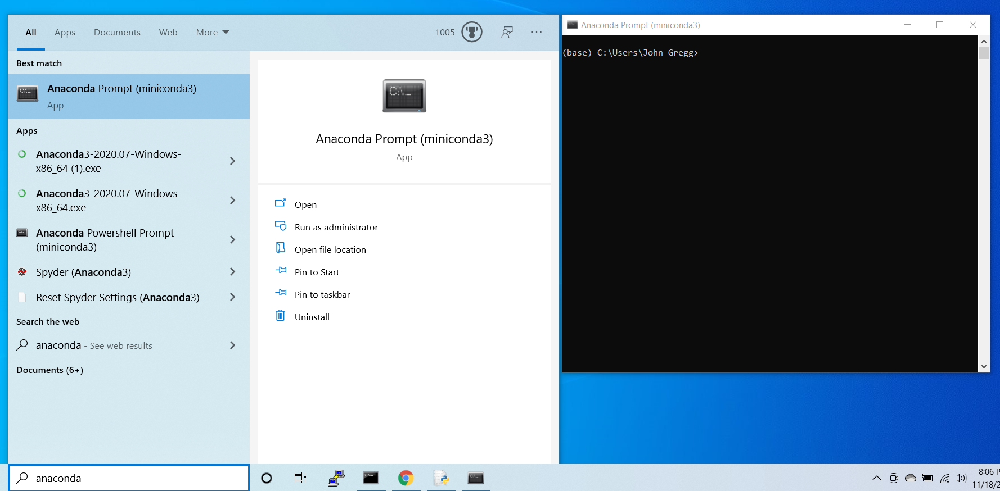

[](https://doi.org/10.21105/joss.02743)

## About REGENS :dna:

REGENS (REcombinatory Genome ENumeration of Subpopulations) is an open source Python package :package: that simulates whole genomes from real genomic segments. 
REGENS recombines these segments in a way that simulates completely new individuals while simultaneously preserving the input genomes' linkage disequilibrium (LD) pattern with extremely high fedility. REGENS can also simulate mono-allelic and epistatic single nucleotide variant (SNV) effects on a continuous or binary phenotype without perturbing the simulated LD pattern. REGENS was measured to be 88.5 times faster and require 6.2 times lower peak RAM on average than a similar algorithm called Triadsim.

## :star2: IMPORTANT NOTICE (PLEASE READ) :star2:

REGENS's simulated genomes are comprised entirely of concatenated segments from the input dataset's real genomes. If your input genomes are not available for public use, then you may not be allowed to publicly release the simulated dataset. Please consult the institutions that provide you access to your input genotype dataset for more information about this matter.

## Instructions to Installing REGENS :hammer_and_wrench:

1. [Install conda](https://docs.conda.io/en/latest/miniconda.html) if you haven't already installed either Anaconda or Miniconda
2. Open your conda terminal. Type "Anaconda" or "Miniconda" into your search bar and open the terminal. It will look like this: 
3. Click the "Anaconda Prompt" app (left) to open the black terminal (right). The terminal's top must say "Anaconda prompt"
4. Enter ```conda create --name regens python=3.7``` in the terminal to create a new environment called regens with python version 3.7
5. Enter ```conda activate regens``` in the terminal to enter your new environment. If that doesn't work, enter ```source activate regens```
6. Once in your regens environment (repeat step 5 if you close and reopen the conda terminal), enter ```pip install regens==0.2.0```
7. Run [this command](https://github.com/EpistasisLab/regens/blob/main/README.md#simulate-genotype-data-computer) to allow regens to download the remaining files. It will write the simulated data into the `examples` folder that it downloads. If you experience permissions issues with this step, [try these remedies](https://github.com/EpistasisLab/regens/blob/main/README.md#remedies-to-known-permission-issues-adhesive_bandage):

## Input :turkey:
REGENS requires the following inputs:
- YOU MUST PROVIDE: real genotype data formatted as a standard (bed, bim, fam) plink _fileset_, ideally containing a minimum of 80 unrelated individuals.
- WE HAVE PROVIDED: a recombination map for every 1000 genomes population. 

The provided recombination maps were created by the [pyrho algorithm](https://github.com/popgenmethods/pyrho) and modified by us to minimize required disk space. [Recombination maps between related populations are highly correlated](https://github.com/EpistasisLab/regens-analysis/blob/master/README.md#about-the-recombination-maps-input-that-we-provided-turkey), so you could pair your input dataset with the recombination map of the most genetically similar 1000 genomes population, as is usually done for SNP imputation. If you wish to make your own recombination map, then it must be formatted as described [here](https://github.com/EpistasisLab/regens/blob/main/README.md#simulate-genotype-data-with-custom-recombination-rate-dataframes-abacus).  

## Output :poultry_leg:
REGENS outputs a standard (bed, bim, fam) plink fileset with the simulated genotype data (and optional phenotype information). 
If plink is not available to you, please consider [bed-reader](https://pypi.org/project/bed-reader/0.1.1/), which reads (bed, bim, fam) plink filesets into the python environment quickly and efficiently. 
 
In phenotype simulation, REGENS also outputs a file containing the R<sup>2</sup> value of the phenotype/genotype correlation and the *inferred* beta coefficients (see [example](https://github.com/EpistasisLab/regens/blob/main/correctness_testing_ACB/ACB_simulated_model_profile.txt)), which will most likely be close to but not equal to the input beta coefficients.

## Simulate genotype data :computer:

The following command uses `ACB.bed`, `ACB.bim`, and `ACB.fam` to simulate 10000 individuals without phenotypes. This command (or any other) will also complete the [final installation step](https://github.com/EpistasisLab/regens/blob/main/README.md#instructions-to-installing-regens-hammer_and_wrench). Windows users should replace all `\`  linebreak characters with `^`.

```shell
python -m regens \
  --in input_files/ACB \
  --out ACB_simulated \
  --simulate_nsamples 10000 \
  --simulate_nbreakpoints 4 \
  --population_code ACB \
  --human_genome_version hg19
```

## Simulate genotype data with custom recombination rate dataframes :abacus:

The following command uses custom recombination rate files as [input for regens](https://github.com/EpistasisLab/regens/blob/main/README.md#input-turkey) instead of the ones provided in the `hg19` and `hg38` folders (though the content in `input_files/hg19_ACB_renamed_as_custom` is just a copy of the content in `hg19/ACB`).  

```shell
python -m regens \
  --in input_files/ACB \
  --out ACB_simulated \
  --simulate_nsamples 10000 \
  --simulate_nbreakpoints 4 \
  --recombination_file_path_prefix input_files/hg19_ACB_renamed_as_custom/custom_chr_
```

Custom recombination rate files are to be named and organized as follows:
- The recombination map must be a single folder (named `hg19_ACB_renamed_as_custom` in the example above) with one gzipped tab seperated dataframe per chromosome.
- Every gzipped tab seperated dataframe must be named as `prefix_chr_1.txt.gz`, then `prefix_chr_2.txt.gz`  all the way through `prefix_chr_22.txt.gz`(`prefix` is named `custom_chr` in the example above).
- the `.txt.gz` files must actually be gzipped (as opposed to a renamed `txt.gz` extension). 
- Each chromosome's recombination map file must contain two tab separated columns named `Position(bp)` and	`Map(cM)`.

The `Position(bp)` column in each chromosome's recombination map is to be formatted as follows:
- The i<sup>th</sup> row of "Position(bp)" contains the genomic position of the left boundary for the i<sup>th</sup> genomic interval.
- The i<sup>th</sup> row of "Position(bp)" is also the genomic position of the right boundary for the (i-1)<sup>th</sup> genomic interval. 
- As such, the last row of "Position(bp)" is only a right boundary, and the first row is only a left boundary. 
- Genomic positions must increase monotonically from top to bottom. 

The `Map(cM)` column in each chromosome's recombination map is to be formatted as follows:
- The i<sup>th</sup> value of "Map(cM)" is the cumulative recombination rate from the first position to the i<sup>th</sup> position in CentiMorgans. 
- In other words, the recombination rate of the interval in between any two rows b and a must equal the Map(cM) value at row b minus the Map(cM) value at row a. 
- As such, the cumulative Map(cM) values must increase monotonically from top to bottom.
- The value of `Map(cM)` in the first row must be 0. 

An example of how this must be formatted is below (remember that there must be one per chromosome, and they must all be gzipped):

```shell
Position(bp)	Map(cM)
16050114	0.0
16058757	0.01366
16071986	0.03912
16072580	0.04013
16073197	0.04079
```

## :apple: Simulate genotype data with phenotype associations :green_apple:

Given at least one set of one or more SNPs, REGENS can simulate a correlation between each set of SNPs and a binary or continuous phenotype.
Different genotype encodings can be applied:

- Normally, if A is the major allele and a is the minor allele, then (AA = 0, Aa = 1, and aa = 2). However, you can _Swap_ the genotype values so that (AA = 2, Aa = 1, and aa = 0).
- You can further transform the values so that they reflect no effect (I), a dominance effect (D), a recessive effect (R), a heterozygous only effect (He), or a homozygous only effect (Ho).

The table below shows how each combination of one step 1 function (columns) and one step 2 function (rows) transforms the original (AA = 0, Aa = 1, and aa = 2) values.

|  Input = {0, 1, 2}   |Identity (I) |   Swap    |
|----------------------|-------------|-----------|
|Identity (I)          |  {0, 1, 2}  | {2, 1, 0} |
|Dominance (D)         |  {0, 2, 2}  | {2, 2, 0} |
|Recessive (R)         |  {0, 0, 2}  | {2, 0, 0} |
|Heterozygous only (He)|  {0, 2, 0}  | {0, 2, 0} |
|Homozygous only (Ho)  |  {2, 0, 2}  | {2, 0, 2} |

### Example 1: a simple additive model :arrow_lower_right:

A full command for REGENS to simulate genomic data with correlated phenotypes would be formatted as follows:

```shell
python -m regens \
  --in input_files/ACB --out ACB_simulated \
  --simulate_nsamples 10000 --simulate_nbreakpoints 4 \
  --phenotype continuous --mean_phenotype 5.75 \
  --population_code ACB --human_genome_version hg19 \
  --causal_SNP_IDs_path input_files/causal_SNP_IDs.txt \
  --noise 0.5 --betas_path input_files/betas.txt
```

This command simulates genotype-phenotype correlations according to the following model.
If we let _y_ be an individual's phenotype, s<sub>i</sub> be the i<sup>th</sup> genotype to influence the value of _y_ such that (AA = 0, Aa = 1, and aa = 2), and _B_ be the bias term. The goal is to simulate the following relationship between genotypes and phenotype:

y = 0.5s<sub>1</sub> + 0.5s<sub>2</sub> + 0.5s<sub>3</sub> + B + &epsilon;

where &epsilon; ~ N(&mu; = 0, &sigma;<sub>&epsilon;</sub> = 0.5E[y]) and E[y] = 5.75.

Notice that the values of &sigma;<sub>&epsilon;</sub> and E[y] are determined by the `--noise` and `--mean_phenotype` arguments.

<!-- h<sub>&theta;</sub>(x) = &theta;<sub>o</sub> x + &theta;<sub>1</sub>x -->
<!--  -->
<!--  -->
<!--  -->

The following files, formatted as displayed below, must exist in your working directory.
`input_files/causal_SNP_IDs.txt` contains newline seperated SNP IDs from the input bim file `input_files/ACB.bim`:
```
rs113633859
rs6757623
rs5836360
```
`input_files/betas.txt` contains one (real numbered) beta coefficient for each row in `input_files/causal_SNP_IDs.txt`:
```
0.5
0.5
0.5
```

### Example 2: inclusion of nonlinear single-SNP effects :arrow_heading_down:

```shell
python -m regens \
  --in input_files/ACB --out ACB_simulated \
  --simulate_nbreakpoints 4 --simulate_nsamples 10000 \
  --phenotype continuous --mean_phenotype 5.75 \
  --population_code ACB --human_genome_version hg19 --noise 0.5 \
  --causal_SNP_IDs_path input_files/causal_SNP_IDs.txt \
  --major_minor_assignments_path input_files/major_minor_assignments.txt \
  --SNP_phenotype_map_path input_files/SNP_phenotype_map.txt \
  --betas_path input_files/betas.txt
```

In addition to the notation from the first example, let S<sub>i</sub> = _swap_(s<sub>i</sub>) be the i<sup>th</sup> genotype to influence the value of _y_ such that (AA = 2, Aa = 1, and aa = 0). Also, we recall the definitions for the four nontrivial mapping functions (R, D, He, Ho) defined prior to the first example. The second example models phenotypes as follows:

y = 0.5s<sub>1</sub>+ 0.5R(S<sub>2</sub>) + 0.5He(s<sub>3</sub>) + B + &epsilon;

where &epsilon; ~ N(&mu; = 0, &sigma;<sub>&epsilon;</sub> = 0.5E[y]) and E[y] = 5.75.

<!--  -->
<!-- 
 -->

Specifying that (AA = 2, Aa = 1, and aa = 0) for one or more alleles is optional and requires `input_files/major_minor_assignments.txt`.

```
0
1
0
```

Specifying the second genotype's recessiveness (AA = 0, Aa = 0, and aa = 2) and third genotype's heterozygosity only (AA = 0, Aa = 2, and aa = 0) is optional and requires `input_files/SNP_phenotype_map.txt`. 

```
regular
recessive
heterozygous_only
```

### Example 3: inclusion of epistatic effects :twisted_rightwards_arrows:

REGENS models epistasis between an arbitrary number of SNPs as the product of transformed genotype values in an individual.

```shell
python -m regens \
  --in input_files/ACB --out ACB_simulated \
  --simulate_nbreakpoints 4 --simulate_nsamples 10000 \
  --phenotype continuous --mean_phenotype 5.75 \
  --population_code ACB --human_genome_version hg19 --noise 0.5 \
  --causal_SNP_IDs_path input_files/causal_SNP_IDs2.txt \
  --major_minor_assignments_path input_files/major_minor_assignments2.txt \
  --SNP_phenotype_map_path input_files/SNP_phenotype_map2.txt \
  --betas_path input_files/betas.txt
```

y = 0.5s<sub>1</sub> + 0.5D(s<sub>2</sub>)s<sub>3</sub>+ 0.2Ho(S<sub>4</sub>)s<sub>5</sub>s<sub>5</sub> + B + &epsilon;

where &epsilon; ~ N(&mu; = 0, &sigma;<sub>&epsilon;</sub> = 0.5E[y]) and E[y] = 5.75.

<!--  -->
<!-- 
 -->

Specifying that multiple SNPs interact (or that rs62240045 has a polynomic effect) requires placing all participating SNPs in the same tab seperated line of `input_files/causal_SNP_IDs.txt`

```
rs11852537
rs1867634	rs545673871
rs2066224	rs62240045	rs62240045
```

For each row containing one or more SNP IDs, `input_files/betas.txt` contains a corresponding beta coefficient. (Giving each SNP that participates in a multiplicative interaction its own beta coefficient would be pointless).

```
0.5
0.5
0.5
```

As before, both `input_files/major_minor_assignments.txt` and `input_files/SNP_phenotype_map.txt` are both optional.
If they are not specified, then all genotypes of individual SNPs will have the standard (AA = 0, Aa = 1, and aa = 2) encoding.

For each SNP ID, `input_files/major_minor_assignments.txt` specifies whether or not untransformed genotypes of individual SNPs follow the (AA = 2, Aa = 1, and aa = 0) encoding.
CAUTION: In general, if a SNP appears in two different effects, then it may safely have different major/minor assignments in different effects.
However, if a SNP appears twice in the same effect, then make sure it has the same major/minor assignment within that effect, or that effect may equal 0 depending on the map functions that are used on the SNP. 

```
0	
0	0
1	0	0
```
For each SNP ID, `input_files/SNP_phenotype_map.txt` specifies whether the SNP's effect is regular, recessive, dominant, heterozygous_only, or homozygous_only.

```
regular
dominant	regular
homozygous_only	regular	regular
```

In context to an epistatic interaction, first the _Swap_ function is applied to SNPs specified by `input_files/major_minor_assignments.txt`, then map functions specified by `input_files/SNP_phenotype_map.txt` are applied to their respective SNPs. The transformed genotypes of SNPs in the same row of `input_files/causal_SNP_IDs.txt` are multiplied together and by the corresponding beta coefficient in `input_files/betas.txt`. Each individual's phenotype is then the sum of row products, the bias, and the random noise term.

## REGENS simulates nearly flawless GWAS data :100:

The Triadsim algorithm simulates LD patterns that are almost indistinguishable from those of the input Dataset. REGENS uses Triadsim's method of recombining genomic segments to simulate equally realistic data, and we measured it to be 88.5 times faster (95%CI: [75.1, 105.0]) and require 6.2 times lower peak RAM (95%CI [6.04, 6.33]) than Triadsim on average. The following three figures show that REGENS nearly perfectly replicates the input dataset's LD pattern. 

1. For the 1000 genome project's ACB population, this figure compares (right) every SNP's real maf against it's simulated maf and (left) every SNP pair's real genotype pearson correlation coefficient against its simulated genotype pearson correlation coefficient for SNP pairs less than  200 kilobases apart. 100000 simulated individuals were used (please note that the analogous figures in the correctness testing folders were only made with 10000 samples, so they have slightly more noticable random noise than the figure displayed directly below). 


2. For the 1000 genome project's ACB population, this figure plots SNP pairs' absolute r values against their distance apart (up to 200 kilobases apart) for both real and simulated populations. More specifically, SNP pairs were sorted by their distance apart and seperated into 4000 adjacent bins, so each datapoint plots one bin's average absolute r value against its average position. 100000 simulated individuals were used. 


3. These figures compare TSNE plots of the first 10 principal components for real and simulated 1000 genomes subpopulations that are members of the AFR superpopulation. Principal components were computed from all twenty-six 1000 genomes population datasets, and the loadings were used to project the simulated individuals onto the PC space. These results demonstrate that REGENS replicates the the input data's overall population structure in simulated datasets. 10000 simulated individuals were used. 


## supplementary details :european_castle:

Thank you concerned reader (for making it this far)!

But our full analysis is in [another repository](https://github.com/EpistasisLab/regens-analysis)!

## Repository structure

### Folders for REGENS to download :inbox_tray:

  * `correctness_testing_ACB`: A directory containing bash scripts to test code correctness on the ACB subpopulation, as well as the output for those tests. Correctness testing part 2 is optional and requires plink version 1.90Beta.
  * `correctness_testing_GBR`: A directory containing bash scripts to test code correctness on the GBR subpopulation, as well as the output for those tests. Correctness testing part 2 is optional and requires plink version 1.90Beta.
  * `examples`: A directory containing bash scripts that run the data simulation examples in the README.
  * `hg19`: for each 1000 genomes project population, contains a folder with one gzipped recombination rate dataframe per hg19 reference human autosome.
  * `hg38`: for each 1000 genomes project population, contains a folder with one gzipped recombination rate dataframe per hg38 reference human autosome.
  * `input_files`: contains examples of regens input that is meant to be provided by the user. The example custom recombination rate information is copied from that of the hg19 mapped ACB population. Also contains input for the Triadsim algorithm. The genetic input labeled as "not_trio" for Triadsim is comprised of ACB population duplicates and is only meant to compare Triadsim's runtime. 
  * `runtime_testing_files`: A directory containing files that were used to compute runtimes, max memory usage values, and improvement ratio bootstrapped confidence intervals.
  * `unit_testing_files`: A directory containing bash scripts to unit test code correctness on the ACB subpopulation, as well as the output for those tests.

### Folders in the repository :file_cabinet:

  * `images`: contains figures that are either displayed or linked to in this github README
  * `paper`: A directory containing the paper's md file, bib file, and figure
  * `thinning_methods`: All code that was used to select 500000 SNPs from the 1000 genomes project's genotype data

### Files :file_folder:

  * `regens.py`: the main file that runs the regens algorithm
  * `regens_library.py`: functions that the regens algorithm uses repeatedly. 
  * `regens_testers.py`: functions used exclusively for correctness testing and unit testing
  * `setup.py` and `_init_.py`: allows regens to be installed with pip
  * `requirements.txt`: lists REGENS' dependencies
  * `regens_tests_info.md`: Installing REGENS also downloads four folders that test REGENS' functionality. The [regens_tests_info.md](https://github.com/EpistasisLab/regens/blob/main/regens_tests_info.md) file explains what they test.   
  
## Remedies to known permission issues :adhesive_bandage:

Try these steps if you had permissions issues with the [final installation step](https://github.com/EpistasisLab/regens/blob/main/README.md#instructions-to-installing-regens-hammer_and_wrench):

1. Right click the "Anaconda Prompt" app (left), then click ```run as administrator```. Reinstalling conda in a different directory may fix this issue permenantly.
2. Your antivirus software might block a file that Anaconda needs (Avast blocked Miniconda's python.exe for us). Try seeing if your antivirus software is blocking anything related to anaconda, and then allow it to stop blocking that file. You could also turn off your antivirus software, though we do not recommend this.  
3. In the worst case, you can download all of the required files with these links:

    1. [input_files](https://ndownloader.figshare.com/files/25515740)
    2. [correctness_testng_ACB, correctness_testng_GBR, examples, runtime_testing, unit_testing_files](https://ndownloader.figshare.com/files/25516322)
    3. [hg19 and hg38](https://ndownloader.figshare.com/articles/13210796/versions/1)
    
Download the three folders containing the aforementioned 8 folders and unzip all folders (only the _folders_, keep the _recombination maps_ in hg19 and hg38 zipped). Then place everything in your working directory and run REGENS from your working directory. You should now be ready to use REGENS in your working directory if you have completed the installation steps. 

## Contributing :thumbsup:
If you find any bugs or have any suggestions/questions, please feel free to [post an issue](https://github.com/EpistasisLab/regens/issues/new)! 
Please refer to our [contribution guide](CONTRIBUTING.md) for more details.
Thanks for your support!

## License
MIT + file LICENSE
