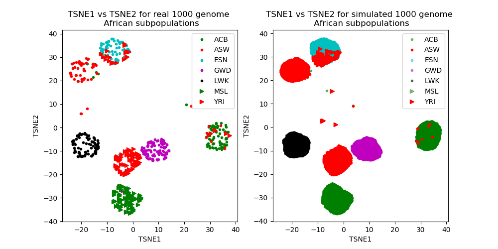

Summary
=======

REcombinatory Genome ENumeration of Subpopulations (REGENS) is an open
source Python package that simulates autosomal genotypes by
concatenating real individuals' genomic segments in a way that preserves
their linkage disequilibrium (LD), which is defined as statistical
associations between alleles at different loci [@slatkin2008linkage].
Recombining segments in a way that preserves LD simulates autosomes that
closely resemble those of the realistic input population [@source:1]
because real autosomal genotypes can be accurately modeled as genomic
segments from a finite pool of heritable association structures (LD
haplotypes) [@source:3]. REGENS can also simulate mono-allelic and
epistatic single nucleotide variant (SNV) effects of any order without
perturbing the simulated LD pattern. The SNVs involved in an effect can
contribute additively, dominantly, recessively, only if heterozygous, or
only if homozygous. All simulated effects contribute to the value of
either a binary or continuous biological trait (phenotype) with a
specified mean value and a specified amount of random noise.

Statement of need
=================

The goal of most genome-wide association studies (GWAS) is to identify
associations between single nucleotide variants (SNVs) and a phenotype
to inform researchers and clinicians about potentially causative genetic
factors. Completing this task will require overcoming numerous
challenges such as insufficient sample sizes and over-representation of
European ancestries [@torkamani2018personal]. Computational biologists
build machine learning models that look for genetic associations in such
unconventional datasets, but the majority of genetic associations have
yet to be discovered [@source:4]. Researchers can use simulated datasets
with known ground truths to assess the effectiveness of an algorithm,
such as the power to detect epistatic effects with dimensionality
reduction techniques [@source:11]. The more closely simulated data
matches real-world data, the more accurate such test results will be.
Since humans of different ancestry have different LD patterns
[@source:5], a simulation that can replicate those patterns from a small
number of real samples is desirable. Therefore, intended users of REGENS
are computational biologists who aim to test a statistical learning
model on simulated GWAS data with precise realistic LD patterns.

Algorithm overview
==================

Two genomic segments are said to be in low LD if alleles are
approximately uncorrelated between the two segments, which is guaranteed
to occur if the boundary separating the segments has a sufficiently high
recombination rate. If two genomic segments from randomly sampled
individuals are concatenated in silico at a boundary with a high
recombination rate (the position of which is referred to as a breakpoint
from here on), then the LD pattern of the resultant in-silico autosomal
genotypes will change minimally [@source:1]. To illustrate this point,
let us let $P(R_i = 1)$ be the probability of *observing* a
recombination event at the $i^{th}$ genomic position. The following
holds: $$\label{eq:e_ri}
P(R_i = 1) = 1 \times P(R_i = 1) + 0 \times P(R_i = 0) = E[R_i],$$
hence, $$\label{eq:e_frac} 
\frac{P(R_i = 1)}{\sum_{i} P(R_i = 1)} = \frac{E[R_i]}{\sum_{i} E[R_i]}.$$\
Drawing simulated breakpoints from the right hand side of (Eq.
[\[eq:e_frac\]](#eq:e_frac){reference-type="ref" reference="eq:e_frac"})
is like drawing differently colored marbles from a jar. Just as the
color composition inferred from drawing (with replacement) a marble from
a jar many times approaches the true distribution of colors, the
distribution of recombination events learned from drawing breakpoints
for many simulated individuals approaches the input population's
distribution of recombination events. Genomic segments that only contain
alleles in high LD are rarely separated by breakpoints, which retains
the original LD pattern (Figure 1).

\
Figure 1: Comparison of population whole genomes in 2 dimensional TSNE
space.

Differentiating attributes
==========================

Many packages were built to simulate genetic data with different goals
in mind. Genetic Architecture Model Emulator for Testing and Evaluating
Software (GAMETEs) simulates simple and epistatic SNV/phenotype
associations quickly but ignores LD patterns [@source:6]. Genome
Simulation of Linkage and Association (GenomeSIMLA) uses forward time
simulation to produce broadly realistic LD patterns. However, these
patterns do not exactly match those of a particular dataset [@source:7].
Triadsim [@source:1] replicates exact LD patterns, but it requires
(mother, father, kin) trios and takes an average CPU-time of 6.8 hours
and an average peak RAM of 54.6 GB to simulate 10000 trios (20000
unrelated GWAS samples) with 4 breakpoints. REGENS uses the same
recombination principles that Triadsim relies on, but it is 88.5 times
faster (95% CI (75.1, 105.0) via bootstrapping) and requires 6.2 times
lower peak RAM (95% CI (6.04, 6.33) via bootstrapping) on average over
10 replicate simulations (Intel(R) Xeon(R) CPU E5-2690 v4 2.60GHz
processor). REGENS also recombines individuals instead of trios to
simulate GWAS data with small publicly available genomic datasets, such
as those in the 1000 Genomes project. This fact allows REGENS to
accurately simulate the full genetic diversity of the world's population
(representative figures are at
<https://github.com/EpistasisLab/REGENS>). Finally, REGENS can simulate
continuous and binary phenotypes that depend on any linear combination
of products of f(SNV) values, where f transforms the standard SNP values
of $\{0,1,2\}$ to represent nonlinear monoallelic effects (such as
dominance). Example implementations of these features are in REGENS'
GitHub repository.

Inspiration and dependencies
============================

REGENS was inspired by Triadsim's idea to draw simulated breakpoints at
locations with higher recombination rates, as well as well as by
GAMETE's objective of simulating data quickly. REGENS relies on
bed-reader, a spinoff of PySnpTools's core .bed file code [@source:8],
to optimally read re-sampled rows from plink bed files as 8
bit integers and then write the 8 bit integer simulated autosomal
genotypes into new bed files. REGENS also relies on the 1000 genomes
project's whole genomes from 26 distinct sub-populations [@source:9],
and it relies on those populations' corresponding genome-wide
sex-averaged recombination rates inferred by the pyrho algorithm
[@source:10].

Acknowledgements
================

We acknowledge contributions from Carl Kadie, who developed PySnpTools,
for implementing its ability to read and write plink bed files as 8 bit
integers. This work was supported by NIH grant LM010098.
